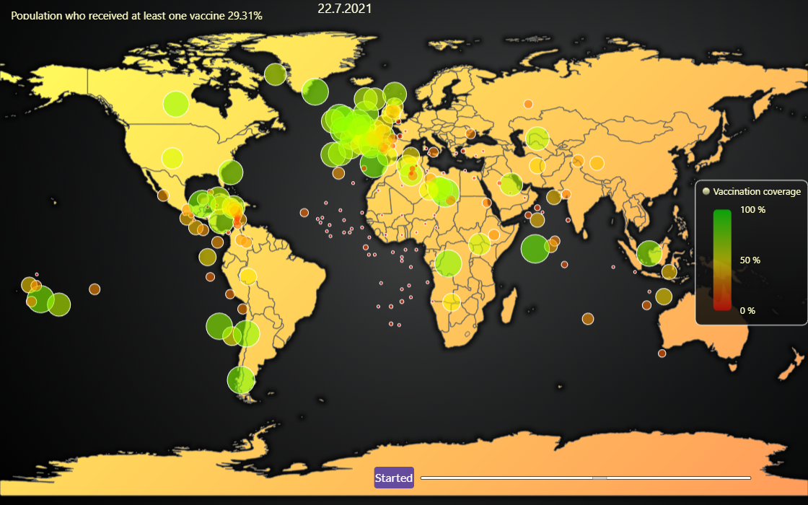

# JavaScript Animated CoVID Vaccination Coverage Chart



This demo application belongs to the set of examples for LightningChart JS, data visualization library for JavaScript.

LightningChart JS is entirely GPU accelerated and performance optimized charting library for presenting massive amounts of data. It offers an easy way of creating sophisticated and interactive charts and adding them to your website or web application.

The demo can be used as an example or a seed project. Local execution requires the following steps:

-   Make sure that relevant version of [Node.js](https://nodejs.org/en/download/) is installed
-   Open the project folder in a terminal:

          npm install              # fetches dependencies
          npm start                # builds an application and starts the development server

-   The application is available at _http://localhost:8080_ in your browser, webpack-dev-server provides hot reload functionality.


## Description

Example which showcases laying LightningChart JS `ChartXY` data visualization features over a LightningChart JS `MapChart`.

This is likely to be the single easiest method available of implementing a geographical data visualization component:

-   **No tile server or large tile storage required**
-   **Can be used offline**
-   **Extremely simple to develop** (minimal setup less than 50 lines of code)

The two charts are laid perfectly over each other by placing them on their own HTML `div` elements with same position and size. To complete the setting, `MapChart` provides a method `onViewChange` which can be used to conveniently synchronize the map latitude and longitude view with the overlaid XY axes.

```js
// Minimal working code for overlaid and synchronized MapChart and ChartXY.
const divMap = document.createElement('div')
document.body.append(divMap)

const divOverlay = document.createElement('div')
document.body.append(divOverlay)

const mapChart = lightningChart()
    .Map({
        type: MapTypes.World,
        container: divMap,
    })
    .setTitle('')

const chart = lightningChart()
    .ChartXY({
        container: divOverlay,
    })
    .setBackgroundFillStyle(transparentFill)
    .setSeriesBackgroundFillStyle(transparentFill)
chart.engine.setBackgroundFillStyle(transparentFill)
chart.getDefaultAxes().forEach((axis) => axis.setTickStrategy(AxisTickStrategies.Empty).setStrokeStyle(emptyLine))

mapChart.addEventListener('viewchange', (event) => {
    const { latitudeRange, longitudeRange, margin } = event
    chart.getDefaultAxisX().setInterval({ start: longitudeRange.start, end: longitudeRange.end })
    chart.getDefaultAxisY().setInterval({ start: latitudeRange.start, end: latitudeRange.end })
    chart.setPadding(margin)
})

divMap.style.width = '100vw'
divMap.style.height = '100vh'
divMap.style.position = 'absolute'
divMap.style.left = '0px'
divMap.style.top = '0px'
mapChart.engine.layout()

divOverlay.style.width = '100vw'
divOverlay.style.height = '100vh'
divOverlay.style.position = 'absolute'
divOverlay.style.left = '0px'
divOverlay.style.top = '0px'
chart.engine.layout()
```

The example animates the progression of first round of Covid-19 vaccines coverage across all countries.

The used data set is from [ourworldindata.org](https://ourworldindata.org/covid-vaccinations)

> Hannah Ritchie, Edouard Mathieu, Lucas Rodés-Guirao, Cameron Appel, Charlie Giattino, Esteban Ortiz-Ospina, Joe Hasell, Bobbie Macdonald, Diana Beltekian and Max Roser (2020) - "Coronavirus Pandemic (COVID-19)". Published online at OurWorldInData.org. Retrieved from: 'https://ourworldindata.org/coronavirus' [Online Resource]

**More map examples**:

-   [Simple Countries Visualization](https://lightningchart.com/lightningchart-js-interactive-examples/examples/lcjs-example-1101-mapChartDynamicColor.html)
-   [Data visualization over Google Maps](https://blog.arction.com/easy-geospatial-data-visualization-with-lightningchart-js-and-google)
-   [LightningChart JS Map Charts with Drill-down](https://lightningchart.com/lightningchart-js-interactive-examples/examples/lcjs-example-1111-covidDrillDownDashboard.html)
-   [Data visualization over static map picture](https://lightningchart.com/lightningchart-js-interactive-examples/examples/lcjs-example-1110-geoChartUsaTemperature.html)


## API Links

* [Point Shape]
* [PalettedFill]
* [MapTypes]
* [transparentFill]


## Support

If you notice an error in the example code, please open an issue on [GitHub][0] repository of the entire example.

Official [API documentation][1] can be found on [LightningChart][2] website.

If the docs and other materials do not solve your problem as well as implementation help is needed, ask on [StackOverflow][3] (tagged lightningchart).

If you think you found a bug in the LightningChart JavaScript library, please contact sales@lightningchart.com.

Direct developer email support can be purchased through a [Support Plan][4] or by contacting sales@lightningchart.com.

[0]: https://github.com/Arction/
[1]: https://lightningchart.com/lightningchart-js-api-documentation/
[2]: https://lightningchart.com
[3]: https://stackoverflow.com/questions/tagged/lightningchart
[4]: https://lightningchart.com/support-services/

© LightningChart Ltd 2009-2025. All rights reserved.


[Point Shape]: https://lightningchart.com/js-charts/api-documentation/v8.0.0/enums/PointShape.html
[PalettedFill]: https://lightningchart.com/js-charts/api-documentation/v8.0.0/classes/PalettedFill.html
[MapTypes]: https://lightningchart.com/js-charts/api-documentation/v8.0.0/variables/MapTypes.html
[transparentFill]: https://lightningchart.com/js-charts/api-documentation/v8.0.0/variables/transparentFill.html

